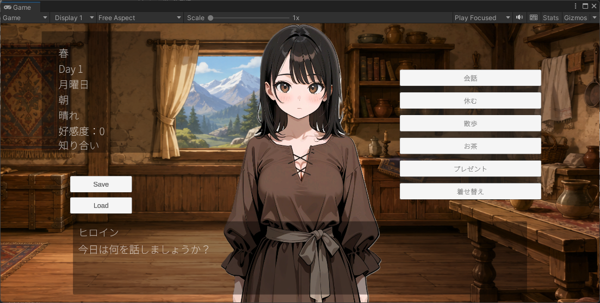

# FantasyLoveSim

Unity で作成された、会話選択と日常行動によって好感度を上げていく恋愛シミュレーションの試作プロジェクトです。

## プレイ画面

プレイ画面のスクリーンショットは `Docs/Images/play-screen.png` に配置しています。

## License

This project is licensed under the MIT License. See [LICENSE](LICENSE) for details.

## 制作メモ

- ソースコードの作成には Codex `gpt-5.4` を使用しました
- 画像の作成には ChatGPT Images 2.0 と Stable Diffusion を使用しました

## 概要

- 画面下の行動ボタンから `会話` / `休む` / `散歩` / `お茶` / `贈り物` を選べる
- 予定パネルから翌日の予定を設定できる
- `会話` からは `Daily` / `Food` / `Adventure` / `Love` のジャンル会話に進める
- `贈り物` 以外に、着替えた衣装への反応を選ぶ `褒める` / `嫌う` / `退屈` / `着替える` の導線がある
- 会話は `Next` ボタンで進行し、必要に応じて選択肢を選ぶ
- 行動と会話の結果は ScriptableObject のデータで管理している
- 衣装ごとの好みや反応履歴を保存し、衣装評価に反映している
- 予定の状態もセーブ/ロードで保存している
- 時間経過と日数進行がある
- 好感度が一定値に達するとエンディングが解放される

## 動作環境

- Unity `2021.3.45f1`
- URP 2D
- TextMeshPro 使用

## 起動方法

1. Unity Hub でこのフォルダをプロジェクトとして開く
2. `Assets/Scenes/MainScene.unity` を開く
3. Play ボタンで実行する
4. Unity で日本語フォントを使える状態にして、`Assets/Fonts/NotoSansJP-VariableFont_wght.ttf` と `Assets/Fonts/NotoSansJP-VariableFont_wght SDF.asset` を再設定する

## 注意

- 日本語アセットの一部はファイルサイズが大きいため、GitHub へそのままコミットできない場合があります
- セットアップ時に不足があれば、`Docs/Images` や `Assets/Images` 配下の画像を個別に追加してください

## 操作

- 画面下の行動ボタンを押す
- `会話` を押した場合はジャンルボタンから会話を開始する
- 予定を選ぶと予定パネルが開き、翌日の予定を設定する
- 予定パネルは戻るボタンで閉じる
- 会話文が表示されたら `Next` ボタンで進める
- 選択肢が出たら、表示された選択肢ボタンを押してから `Next` ボタンで確定する
- `休む` / `散歩` / `お茶` / `贈り物` はそのまま実行され、結果表示後に `Next` で戻る
- 好感度が `100` に達すると `Ending` ボタンが表示される

## ゲームの流れ

- 行動を選ぶ
- 必要なら会話ジャンルを選ぶ
- ヒロインの返答や結果を見る
- 好感度が変化する
- 時間が進む
- 日数が進み、条件を満たすとエンディングへ進める

## 主なファイル

- [`Assets/Scripts/Core/GameManager.cs`](Assets/Scripts/Core/GameManager.cs): 会話、行動、好感度、時間進行、UI 更新の制御
- [`Assets/Scripts/Action/`](Assets/Scripts/Action): 行動データの型定義
- [`Assets/Scripts/Outfit/`](Assets/Scripts/Outfit): 衣装データ、衣装反応、衣装評価の管理
- [`Assets/Scripts/Schedule/`](Assets/Scripts/Schedule): 予定データと予定パネルの制御
- [`Assets/Scripts/Conversation/`](Assets/Scripts/Conversation): 会話データの型定義
- [`Assets/Resources/Actions/`](Assets/Resources/Actions): 行動データ本体
- [`Assets/Resources/Actions/ScheduleAction.asset`](Assets/Resources/Actions/ScheduleAction.asset): 予定パネルを開く行動データ
- [`Assets/Resources/Outfits/`](Assets/Resources/Outfits): 衣装データ本体
- [`Assets/Resources/Conversations/`](Assets/Resources/Conversations): 会話データ本体
- [`Assets/Scenes/MainScene.unity`](Assets/Scenes/MainScene.unity): メインシーン
- [`Packages/manifest.json`](Packages/manifest.json): 利用パッケージ

## メモ

- 画面上の日本語テキストは TextMeshPro のフォント資産を利用しています
- 会話データと行動データは ScriptableObject として分離されています
- 行動には条件付き反応を持たせられるので、時間帯や天候で結果を変えやすいです
- 衣装は着用時に保存され、衣装反応パネルから評価を付けられるようになっています
- 予定は `ScheduleManager` で管理され、保存データにも反映されています
- 予定の保存と復元は動作確認済みです
- 背景ズーム用の `BackgroundZoom` を使って、会話や窓を見る演出を切り替えています
- このプロジェクトは試作段階のため、今後 UI や会話データを拡張しやすい構成になっています
